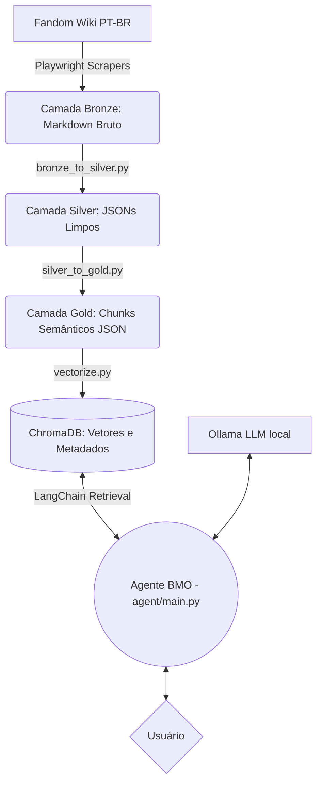

# 🤖 BMO Brain — Base de Conhecimento & Agente IA

> *"Eu sou o BMO! Bip bop! Eu sei tudo sobre a Terra de Ooo!"*

O **BMO Brain** não é apenas uma base de dados, é a mente e o coração de um agente de Inteligência Artificial desenhado para agir, pensar e falar exatamente como o personagem BMO da série **Hora de Aventura (Adventure Time)**. 

Este projeto implementa uma **Arquitetura Medallion (Bronze, Silver, Gold)** de pipeline de dados (ETL) acoplada a um poderoso sistema **RAG (Retrieval-Augmented Generation)** utilizando **LangChain**, **Ollama** e **ChromaDB**.

---

## 📐 Arquitetura do Sistema



---

## 🗂️ Estrutura do Projeto

```text
Projeto-BMO/
├── bmo_brain/
│   ├── agent/               
│   │   └── main.py          # 🤖 Aplicativo principal do Agente RAG BMO
│   │
│   ├── database/
│   │   └── chroma_db/       # ChromaDB persistente com +3000 chunks vetorizados
│   │
│   ├── knowledge/
│   │   ├── bronze/          # 🟤 Dados brutos dos scrapers (Arquivos .md)
│   │   ├── silver/          # ⚪ Dados limpos estruturados (Arquivos .json)
│   │   └── gold/            # 🟡 Chunks contextuais enriquecidos para RAG (.json)
│   │
│   └── scripts/             # 🛠️ Scripts do Pipeline
│       ├── scrape_*.py      # Scrapers (episódios, personagens, lugares, itens)
│       ├── bronze_to_silver.py
│       ├── silver_to_gold.py
│       └── vectorize.py
│
├── pyproject.toml           # Configurações do ambiente (uv)
└── README.md
```

---

## ⚙️ O Pipeline de Dados (Medallion)

### 1. 🟤 Camada Bronze (Scraping)
Scrapers assíncronos utilizam `Playwright` e `BeautifulSoup` para navegar pela Wiki do Hora de Aventura e extrair artigos de Episódios, Personagens, Lugares e Objetos. O conteúdo bruto é salvo em formato Markdown com cabeçalho YAML (Frontmatter).

### 2. ⚪ Camada Silver (Limpeza e Estruturação)
O script `bronze_to_silver.py` corrige falhas de formatação, uniformiza seções irregulares criadas por fãs da wiki, normaliza nomes de personagens e extrai um JSON limpo, consolidado e seguro.

### 3. 🟡 Camada Gold (Context-Aware Chunking)
O script `silver_to_gold.py` quebra os documentos da camada Silver em pedaços menores (chunks). Em vez de usar divisões aleatórias por "tamanho de tokens" (que podem quebrar o sentido de uma frase), o script realiza recortes lógicos (ex: parágrafos da seção de relacionamentos). 
**O diferencial RAG:** O script "injeta" um cabeçalho explícito (uma *Anchor Sentence*) como `[Personagem: Marceline | Categoria: Núcleo principal]` em todos os sub-chunks para garantir que o LLM nunca perca o contexto do que está lendo.

---

## 🧠 Vetorização e Busca (ChromaDB)

O `vectorize.py` carrega os chunks da camada Gold, calcula os *Embeddings* matemáticos utilizando o modelo avançado `intfloat/multilingual-e5-large` (otimizado para português) e salva no **ChromaDB**. 

- **Prefixos E5:** O embedder utiliza strict guidelines inserindo os prefixos automáticos de `passage:` para armazenamento e `query:` para as perguntas do usuário, garantindo similaridade excepcional na busca vetorial.
- **Batches:** A vetorização ocorre em *batches* de 64 documentos simultâneos para aliviar o uso de VRAM (RAM de Vídeo).

---

## 🎮 Agente BMO (O RAG Final)

Execute o agente e converse com o BMO de verdade: `uv run bmo_brain/agent/main.py`.

A aplicação conecta o LLM local (via **Ollama**) ao Vector Store em milissegundos.
- **Retrieval:** Recebe a pergunta do usuário e busca as 7 memórias mais parecidas no banco do ChromaDB.
- **LLM Engine:** Recomendado o uso do `gemma3:4b` ou `qwen2.5:3b` que rodam rapidamente e localmente sem custos de API.
- **Personalidade:** Um complexo *System Prompt* no LangChain força a IA a abandonar a forma engessada de "assistente prestativo" para falar na terceira pessoa, emitir barulhos de circuito (`bip bop!`), ser ingênuo e referenciar os episódios estritamente baseados nas memórias carregadas do ChromaDB, ignorando o próprio treinamento mundial do modelo.

---

## 🚀 Como Executar

O projeto utiliza o **`uv`** moderno da Astral para gestão veloz de pacotes.

### 1. Instalando Dependências
```bash
# Clone este repositório
git clone https://github.com/Guilin-Git/Projeto-BMO.git
cd Projeto-BMO

# Instale os pacotes pelo uv
uv sync
```

### 2. Rodando o Pipeline de Dados Completo (Opcional)
Se desejar reprocessar as páginas ou se atualizar, rode o pipeline em ordem:
```bash
# Atualiza os dados de Bronze para Silver
uv run bmo_brain/scripts/bronze_to_silver.py

# Prepara os chunks contextuais Silver para Gold
uv run bmo_brain/scripts/silver_to_gold.py

# Aplica os Embeddings NPL e insere no Banco Vetorial
uv run bmo_brain/scripts/vectorize.py
```

### 3. Ligando o BMO (Interface de Chat)
Lembre-se de ter o [Ollama](https://ollama.com/) instalado em sua máquina e com o modelo em pull (ex: `ollama pull gemma3:4b`).
```bash
uv run bmo_brain/agent/main.py
```

---

> *"Quem quer jogar videogame comigo agora?!"* — **BMO**
