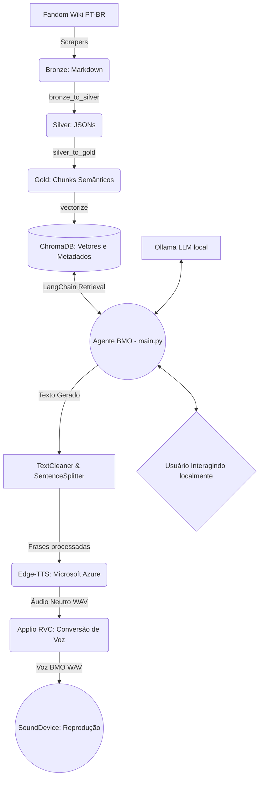

# 🤖 BMO Brain + Voice — Agente IA Sensorial

> *"Quem quer jogar videogame comigo agora?!"* — **Biimo**

O **BMO Brain** não é apenas uma base de dados, é a mente e o coração de um agente de Inteligência Artificial desenhado para agir, pensar e **falar** exatamente como o personagem BMO da série **Hora de Aventura (Adventure Time)**. 

Este projeto implementa uma **Arquitetura Medallion (Bronze, Silver, Gold)** de pipeline de dados acoplada a um poderoso sistema **RAG (Retrieval-Augmented Generation)** utilizando **LangChain**, **Ollama**, **ChromaDB** e um pipeline completo de **Sintese de Voz em Tempo Real (TTS + RVC)**.

---

## 📐 Arquitetura do Sistema Inteiro

Abaixo está o mapeamento dos fluxos de Extração de Conhecimento, Geração de Resposta e Síntese de Áudio:



---

## 🗂️ Estrutura do Projeto

```text
Projeto-BMO/
├── bmo_brain/               # 🧠 Cérebro (RAG, Scraping e Agente LLM)
│   ├── agent/main.py        # OChatbot REPL que orquestra LLM e Áudio
│   ├── database/            # Banco vetorial local ChromaDB
│   ├── knowledge/           # Datasets das camadas Medallion (Textos da Wiki Ooo)
│   └── scripts/             # Scripts de ETL e Vetorização 
│
├── bmo_voice/               # 🎙️ Cordas Vocais (Pipeline TTS e Conversão)
│   ├── voice_engine.py      # Motor Assíncrono para latência zero
│   ├── text_cleaner.py      # Filtro de emoções e pausas sonoras
│   ├── config.py            # Configura velocidade, pitch e modelos
│   ├── voice_models/        # Modelos Treinados .pth e .index do BMO
│   ├── tts_backends/        # Gerador de Sotaques (Edge-TTS Microsoft)
│   └── rvc_backends/        # Modulador de Voz (Applio Subprocess via CLI)
│
├── pyproject.toml           # Configurações do ambiente (uv)
└── README.md
```

---

## ⚙️ 1. O Pipeline de Conhecimento (RAG)

1. **Scraping e Ouro (O Pipeline Medallion):** Extraímos dados cru da wiki do Hora de Aventura, limpamos discrepâncias (Silver) e aplicamos recortes baseados em contexto lógico (Gold), injetando *Anchor Sentences* (`[Personagem: Finn]`) em cada frase.
2. **Embeddings:** Os recortes são convertidos em espaço vetorial matematicamente via `intfloat/multilingual-e5-large` (HuggingFace) e engolidos pelo **ChromaDB**.
3. **Loop Contínuo (REPL):** Para evitar atrasos no carregamento do Modelo de Embeddings gigante e do Banco de Dados a cada pergunta, o `main.py` roda de forma contínua no terminal, reduzindo a busca na memória de ~70segundos para míseros **0.2s**. O LLM usado roda localmente puxado do **Ollama** (ideal: `gemma3:4b` ou superior).
4. **Personalidade (System Prompt):** Regras estritas barram o BMO de parecer um assistente ou IA. Ele assume que a "Terra de Ooo" é o momento presente, sendo restrito a conversas simplificadas, poéticas e que fluem organicamente como um menino fofo de jogo.

---

## 🎙️ 2. A Mágica Vocal (Voice Engine)

O desafio de "Falar em Tempo Real" enquanto uma IA pesada pensa é resolvido através da `VoiceEngine`, utilizando paralelismo quádruplo e modelo VITS invertido:

1. **Text Cleaner & Buffer:** O motor varre e tranca ruídos, exclamações gigantes e limpa formatações cênicas como `*sorri*`. Ele encadeia micro-frases (`Ele é legal. Tudo bem.`) num bloco coeso `>60 caracteres` para não forçar a IA gaguejar ou pausar ociosamente.
2. **Edge-TTS / Tesoura Digital:** O texto viaja online direto pros servidores da Azure, sendo lido pela voz neural super veloz `pt-BR-FranciscaNeural`. Quando o áudio neutro volta pra BMO, um script digital em *Numpy* corta fora todos os "milissegundos de eco e fôlego vazios" da IA da Microsoft da borda do aúdio.
3. **Applio / RVC em Subprocess:** O áudio recortado é injetado sob o modelo acústico do próprio BMO `BMOcvlc1`. Para zerar bugs de bibliotecas de rede, o RVC não é chamado por APIs normais, e sim executando os binários internos Python do `Applio` direto do HD. A voz da "Francisca" assume as cordas vocais ressonantes fofas originais do desenho!
4. **Pipelining Assíncrono:** Ao mesmo tempo em que a primeira frase do RVC está sendo cantada no falante pelo `sounddevice` em *streaming*, a frase 2 já está no inferidor RVC e a 3 já está na Microsoft sendo gerada — **0 delay de espera total**.

---

## 🚀 Como Executar Passo a Passo

O projeto utiliza o **`uv`** moderno da Astral Python para gestão extrema de pacotes e virtualenvs.

### 1. Preparando os "Órgãos" (Servidores Base)
Para o BMO existir sem nuvens ou apagar dados seus, precisamos de dois "Motores Universais" instalados no seu PC fora da pasta:

- **Ollama:** Instale o [Ollama Local](https://ollama.com/) e baixe o LLM puxando `ollama pull gemma3:4b`.
- **Applio (RVC):** Baixe o [Applio V3.6.2](https://github.com/IAHispano/Applio) em alguma pasta (ex: `C:/ApplioV3.6.2`). Rode o `.bat` padrão dele uma vez para instalar seus requisitos.

### 2. Baixando a Consciência do BMO
```bash
# Clone e baixe as dependências instantaneamente com UV
git clone https://github.com/Guilin-Git/Projeto-BMO.git
cd Projeto-BMO
uv sync
```

### 3. Ligando a Conversa Interativa!
Inicie ambos em terminais separados:

**Terminal 1 — Liga as Cordas Vocais do Applio:**
Vá na pasta onde instalou o Applio e levante-o na porta 7865:
```bash
cd C:/ApplioV3.6.2
.\env\python.exe app.py --port 7865
```

**Terminal 2 — Acorda o BMO:**
No projeto do BMO, rode o agente interativo. Ele irá carregar os ~3 GBs de Memória da série na RAM (Leva de 20s a 60s). Quando aparecer *BMO carregado...* você poderá conversar à vontade usando o RAG super veloz através do Chat!
```bash
uv run python bmo_brain/agent/main.py
```

---

> *"Yay! Isso sim que é computação!"* — **Biimo**
